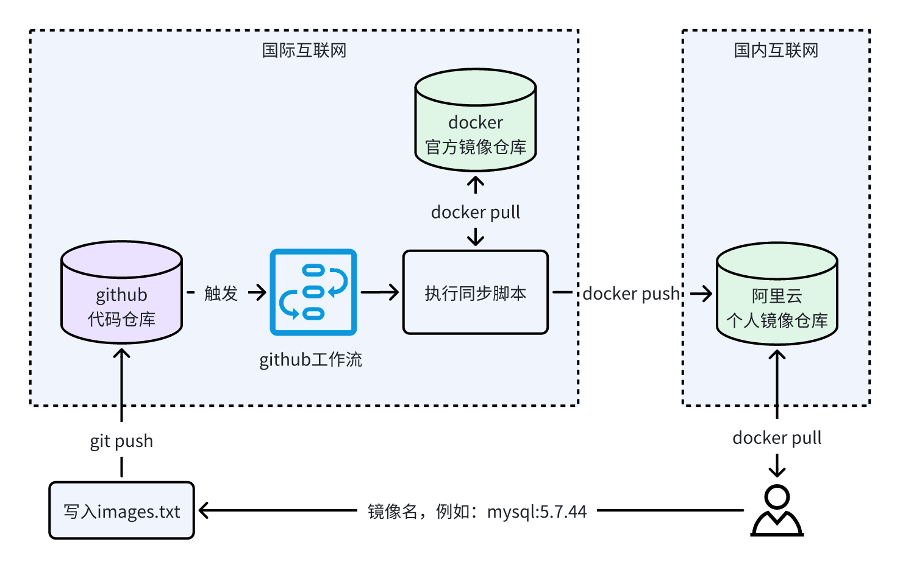
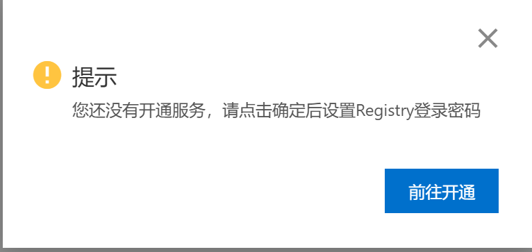
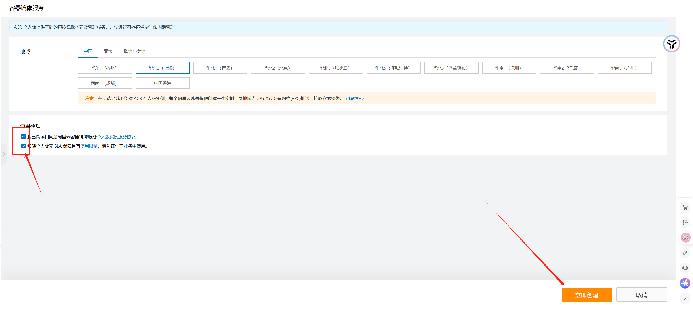
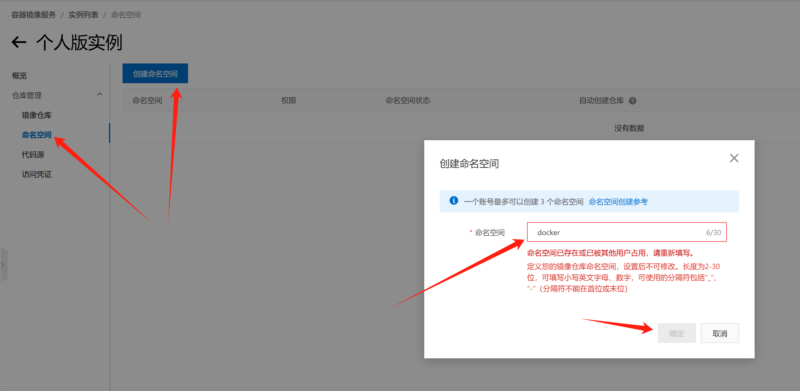
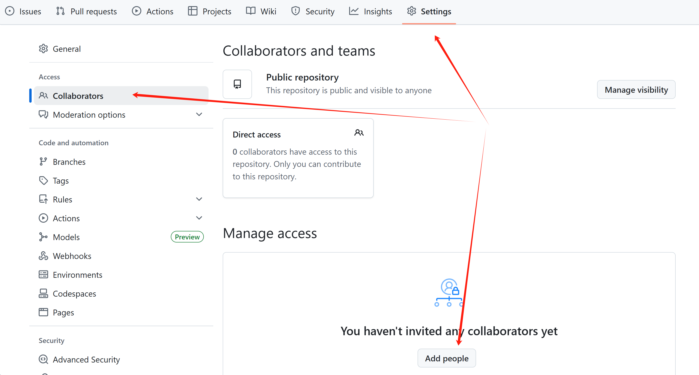
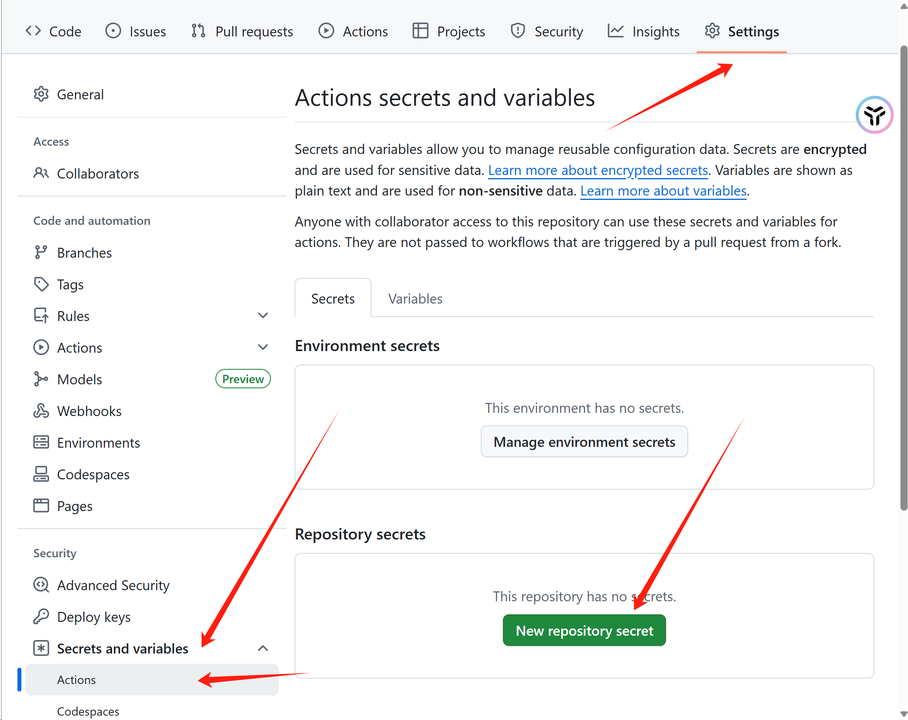
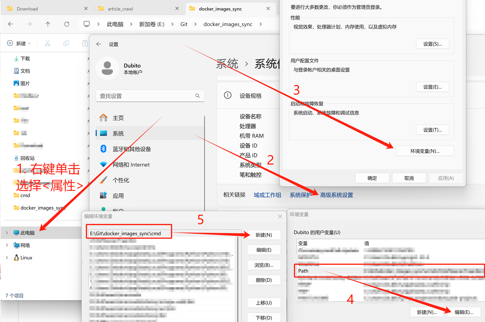
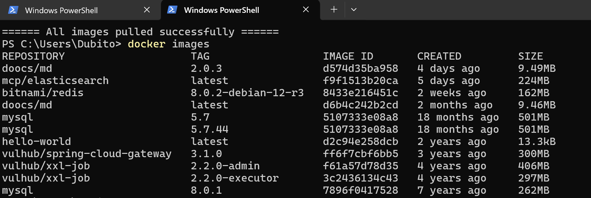
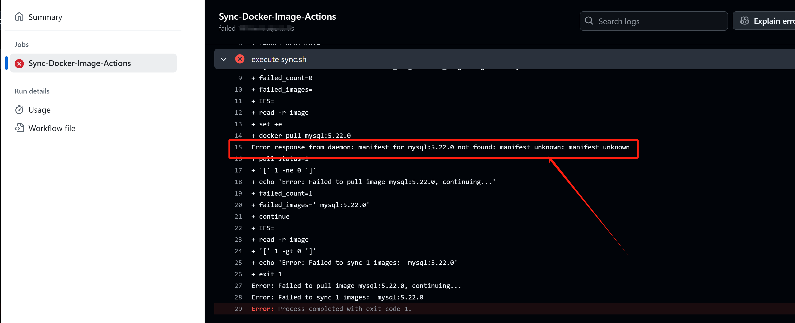

# docker_image_sync

实现效果：

只需一次初始化配置，即可在任意目录下通过执行命令`docker_pull mysql:8.0.1 mcp/elasticsearch:latest bitnami/redis:8.0.2-debian-12-r3` ，稍等片刻，实现成功拉取：


## 1. 方案原理
整体方案架构如图所示（所有步骤整合形成了一键自动化脚本，这里架构中的步骤仅为了原理理解）：



对于希望下载的镜像（例如：`mysql:5.7.44`）：

1. 将镜像名写入`images.txt`
2. 将变更提交到git仓库
3. 触发github工作流，工作流中定义了执行的脚本
4. 工作流自动执行同步脚本，从docker官方镜像站pull镜像，并上传到阿里云个人镜像仓库中
5. 用户再从阿里云个人镜像站拉取镜像
6. 将拉取到的镜像重命名为目标镜像tag

通过github工作流+阿里云个人镜像仓库的方式，实现从官方镜像站拉取镜像。

具有以下优点：

* **无需梯子**：github可以直接访问、提交文件变更；阿里云个人镜像仓库国内可以满速访问，嘎嘎快
* **无需服务器**：借助github工作流的容器环境实现镜像同步
* **免费**：阿里云个人镜像站可免费创建，总限额300个，用超了删了就行
* **无拉取限制**：经过测试，暂时未发现原官方镜像站设定的每小时只能拉取10个镜像的限制（猜测可能对github出口ip进行了加白）
* **稳定**：只需要部署成功，即可稳定使用
* **使用便捷**：该方案看起来步骤复杂，但作者对其进行了脚本封装（支持windows、linux和mac），配置完成后，所有步骤可浓缩为一句类似原生命令的`docker_pull 镜像tag`即可拉取镜像

## 2. 方案配置
在使用前需要先进行配置，配置分为3个步骤：阿里云个人镜像仓库配置、git仓库配置、脚本配置

环境依赖：

* git，并配置账号密码或密钥（推荐）
* 阿里云账号，并实名。若无，可去[阿里云官方网站](http://https:www.aliyun.com)注册一个
* docker

### 2.1 阿里云个人镜像仓库申请
1. **开通容器镜像服务**
首先访问[https://cr.console.aliyun.com/cn-shanghai/instance/namespaces](https://cr.console.aliyun.com/cn-shanghai/instance/namespaces) ，若不存在镜像仓库，则会弹窗提示你开通：



点击前往开通，选择离你机器地理位置最近的地域，勾选使用须知，点击立即创建即可：



2. **设置镜像仓库登录密码**

服务开通后，界面会出现指引，点击`设置Registry登录密码`按钮即可：


若界面没有该显示，可点击左侧导航栏的`访问凭证`设置：


记住这里设置的密码，后续会用到。
注意：若想要共享搭建的服务，这里的仓库密码最好和阿里云账户密码**不一致**

3. **创建命名空间**

点击左侧导航栏的命名空间，然后点击`创建命名空间`按钮，输入一个独特的命名空间名称后点击确定：



记住该命名空间名称，后续配置会用到。

4. **记录登录凭证**

点击左侧导航栏的`登录凭证`，记下仓库地址，后续配置会用到：


### 2.2 git仓库配置
1. **fork仓库**
fork开源仓库[https://github.com/you8023/docker\_images\_sync](https://github.com/you8023/docker_images_sync) 到自己git账号（可以的话帮忙点个start就更好了^-^）
注1：若希望拉取的镜像tag保密，需自行创建权限为`private`的仓库，然后将本仓库克隆再上传到私密仓库
注2：若希望配置的服务给好友分享使用，可在设置中的`Collaborators`处邀请好友（需好友同意邀请）：



2. **配置仓库全局变量**

依次点击`Settings` -> `Secrets and Security` -> `Actions`，点击`New respository secret`按钮添加仓库变量：



添加以下4个全局变量：

* `DOCKER_USER`：阿里云账户
* `DOCKER_PWD`：2.1中第2步设置的阿里云镜像仓库密码
* `DOCKER_REGISTRY`：2.1中第4步中记住的登录凭证页面中的仓库地址
* `DOCKER_NS`：2.1中第3步创建的命名空间名称

添加后应能看到：


3. **克隆仓库**

来到自己fork的仓库，复制地址，使用`git clone xxx`克隆仓库到本地

### 2.3 脚本配置
1. 复制本地仓库中的`cmd/conf.yaml.default`文件并命名为`cmd/conf.yaml`
2. 编辑`cmd/conf.yaml` ，配置说明如下：

```bash
registry: 阿里云个人镜像仓库地址，形如：crpi-xxx.cn-xxx.personal.cr.aliyuncs.com
namespace: 阿里云个人镜像仓库命名空间名称
images_dir: git仓库路径，例如："E:\Git\docker_images_sync"
max_retries: 拉取镜像重试次数，默认为60
retry_delay: 拉取镜像尝试间隔（秒），默认为1
first_delay: 将镜像tag提交后等待多久开始尝试拉取镜像（秒），默认为20
```
3. 打开cmd或bash终端，登录阿里云镜像仓库，登录后会自动记住密码：

```bash
docker login <阿里云个人镜像仓库地址>
```
4. 添加脚本目录到环境变量中

**windows系统**：

   1. 在文件夹左侧右键单击此电脑，选择`属性`
   2. 在弹出的对话框中点击`高级系统设置`
   3. 在弹出的对话框中点击`环境变量`
   4. 在弹出的对话框中找到`Path`变量，点击`编辑`
   5. 在弹出的对话框右侧点击`新建`，添加cmd目录路径，例如：`E:\Git\docker_images_sync\cmd`




**Linux系统**：

1. 对docker\_pull脚本添加执行权限（其中的路径需替换为自己的）：

```bash
sudo chmod +x /home/dubito/git/docker_images_sync/cmd/docker_pull
```
2. 使用命令编辑\~/.bashrc：

```bash
vim ~/.bashrc
```
将以下语句添加到文件中（其中的路径需替换为自己git仓库下cmd目录的路径）：

```bash
export PATH=$PATH:/home/dubito/git/docker_images_sync/cmd
```
3. 执行命令使配置生效：

```bash
source ~/.bashrc
```
**Mac系统**：

参考linux系统配置（目前手头没有mac设备，暂未测试，测试了的小伙伴可以留个言反馈一下，如果有问题欢迎提issue）。

## 3. 方案使用
注1：若是 fork 项目，因为 GitHub 安全风险的原因，需要在 GitHub 项目界面 Actions 确认风险提示，才能在后面脚本中能够通过 GitHub Actions 自动构建

配置完毕后，在任意目录下使用命令即可正常拉取镜像：

```bash
docker_pull mysql:8.0.1
```
也可通过空格分隔一次性拉取多个镜像：

```bash
docker_pull mysql:8.0.1 mcp/elasticsearch:latest bitnami/redis:8.0.2-debian-12-r3
```
拉取成功如图所示：




注：如果拉取失败，可以在github查看工作流状态和日志：


图中为尝试拉取一个不存在的镜像：



